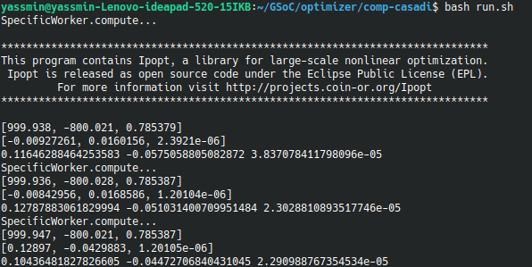
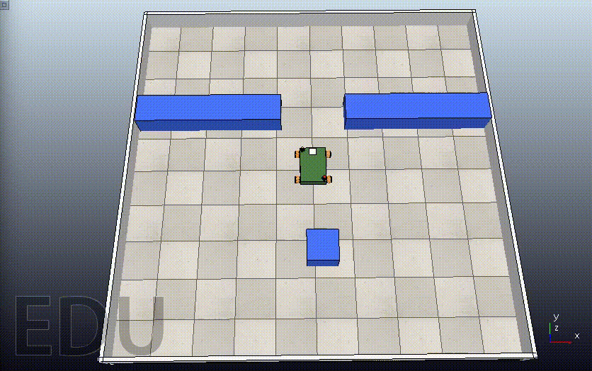
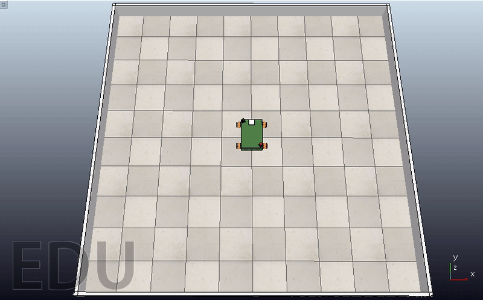
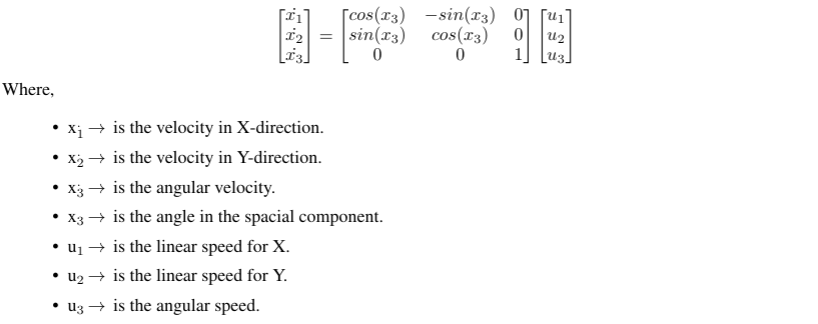
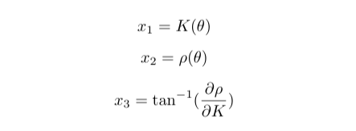
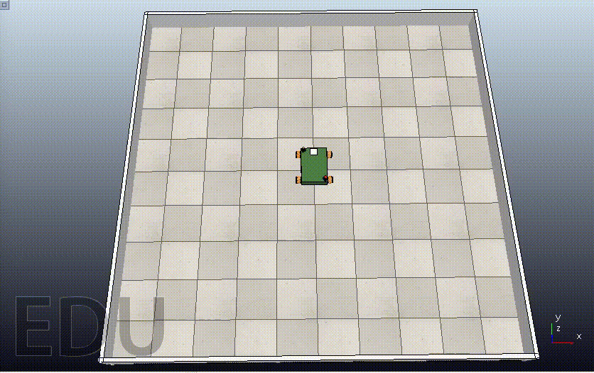

# Optimizer
### GSoC'21 RoboComp project: Simultaneous path planning and following using Model Predictive Control (SPAF) 
- [Robocomp Posts](https://robocomp.github.io/web/gsoc/2021/posts/index)
- [Paper](https://www.overleaf.com/read/pqyzhvwmxnmf)
- [Proposal](https://drive.google.com/drive/folders/1uvJ-55CTLIYTtSp7vvevxFzt1HJOoXk0?usp=sharing)

# Installation
To start, we need to install the following:
1. [Robocomp](https://github.com/robocomp/robocomp)
2. [CoppeliaSim](https://www.coppeliarobotics.com/)
3. [PyRep](https://github.com/stepjam/PyRep)
4. [Optimizer components](https://github.com/Yasmin-Hesham/optimizer)

Hints: 
 - Carefully follow the instructions listed in the readme files.
 - Install Robocomp first, then Pyrep and make sure that the “.bashrc” file    includes the correct paths of (Robocomp’s root, Coppeliasim’s root only).

## How to get started
1. Pull the [Github Repo](https://github.com/Yasmin-Hesham/optimizer)
2. Build the component as described in the [tutorial](https://github.com/robocomp/robocomp/blob/development/doc/robocompdsl.md) by running in the component's path two commands:
   -  cmake . 
   -  make
3. To run the simulation on CoppeliaSim:
   - Run the “run.sh” in OmniPyrep from a terminal.
    
   - From another terminal, run the “run.sh” in comp-casadi.
    

## MPC for Point Stabilization
The optimizer component is the controller of the Viriato Robot to ensure better stabilization and smooth motion. It’s connected to other agents that send the data used to drive the robot autonomously. 
In order to start the project, we should create our own component that implements MPC, and also, it should interface with the “OmniPyrep” component for the simulation and hence, the testing phase. 
 
The optimizer is developed by using IPOPT solver from [CasADi](https://web.casadi.org/), using Python 3. IPOPT is a free open-source solver in [CasADi](https://web.casadi.org/) that solves NLP problems. 
The idea consists of feeding the NLP solver by the cost function, which is simply the evaluation of the cost running along the prediction horizon. And for better optimization, constraints and weights are added to penalize the control actions thus obtaining a better output flow. 

The MPC code consists of two files to be organized: 
- **MPCTools:** includes all the necessary vectors and parameters that are used for the model.
- **MPCModel:** includes the MPC’s functionality and MPC’c class that is used in the “specific_worker.py” file.
In “specific_worker.py”, a rotation matrix was added to transform the control states from the world’s frame to the robot’s frame which is the reference frame used in MPC. We pass three vectors to the MPC:
- The initial states (i.e. The initial values for the optimization of states along the prediction horizon.)
- The target states (i.e. The goal point to be reached.)
- The control states (i.e. The initial values for the optimization of control actions obtained from the previous iteration.)
And finally, it returns the optimal control actions’ vector as showing in the code in `specificworker.py`:

```   python
def compute(self):
        tic = time()
        print('SpecificWorker.compute...')
 
        # get current pose in world frame
        currentPose = self.omnirobot_proxy.getBaseState()
        
        rotMat = np.array([
            [cos(-currentPose.alpha), -sin(-currentPose.alpha), 0],
            [sin(-currentPose.alpha),  cos(-currentPose.alpha), 0],
            [0                      ,  0                      , 1]
        ])
 
        initialState = ca.DM([currentPose.x, currentPose.z, currentPose.alpha])
        controlState = rotMat @ ca.DM([[currentPose.advVx, currentPose.advVz, currentPose.rotV]]).T
        targetState = ca.DM([1000,-800,pi/4])
 
        # calculate mpc in world frame
        controlMPC = self.controller.compute(initialState, targetState, controlState)
        # apply speed
        vx, vy, w = list(np.array(controlMPC.full()).flatten()) 

        self.omnirobot_proxy.setSpeedBase(vx, vy, w)
        
        print(initialState)
        print(controlState)
        print(vx, vy, w)
 
        return True
 ```

**The Simulation:** 
Giving the robot a target to reach, the output simulation shows the flow of the motion. For example, when setting `targetState = ca.DM([1000,-800,pi/4])`, the output is as follows.



# Differential Robot
Many mobile robots use differential drive mechanism in their motion. By definition, it's simplest form consisting of two wheels mounted on a common axis, where each wheel must rotate about a point lying on it know as the Instantaneous Center of Curvature (ICC), and each wheel can be driven independently in a direction. The equations of the velocity for each side (right and left) can be described as follows: 


Knowing that "w" is the angular velocity, "R" the signed distance from the ICC to the midpoint between the wheels, and finally "l" is the distance between the centers of the two wheels.

Moreover, by studying the equation with respect to "R" and "w", we can deduce three senarios:


- When the two velocities are equal in magnitude and direction, the robot will move linearly (R tends to infinity).
- When the two velocities are equal in magnitude but with opposite direction, the robot will rotate in place.
- When only one velocity is equal to zero, the robot will rotate about one side wheel.

To switch between the omni-directional drive mode and the differential drive mode, a flag is raised. Intuitively, it sets the lower and upper bounds of the normal velocity component of the robot (i.e., Vx the velocity in X-direction) by zero.

```python
        if isDifferential:
            args['lbx'][h_states: h_states+h_controls: n_controls+1] = 0
            args['ubx'][h_states: h_states+h_controls: n_controls+1] = 0
```
This also can be proved mathematically. In order to satisfy the mecanum wheeled robot's inverse kinematic model, the trick lies on assuming two wheels instead of four. This will leads us to the same condition for the boundries.

```python
        # calculate mpc in world frame
        controlMPC = self.controller.compute(initialState, targetState, controlState, isDifferential=True)
```
**The Simulation:**
By giving the robot a point [1200,1800,0.5pi] as a target to compare the motion between differential mode and omni-directional mode.

1. **Differential Mode:**


2. **Omni-directional Mode:**



# Path Following
The path is defined as a set of connected points that fit a line or a curve. Then, the path following problem is a control task in which a geometric reference is to be followed without involving time as a constraint. Based on this intuitive idea, the path can be formed by fitting a polynomial function with a specific order to each of the states. In other words, each state is represented by a series of coefficients of the polynomial that defines this state.
We begin with the kinematic model for omni-directional robot:


And differentiate the states with respect to the path parameter since they are polynomial functions as follows:


An impressive and brilliant idea was introduced in "Predictive Path Following of Mobile Robots without Terminal Stabilizing Constraints" paper. It introduces and spots the light on adding a path parameter to the states and treat it as virtual state. This additional state indicates the progress of the robot along the predefined path. Similarly, a virtual control is also introduced. It is considered the control action that governs the virtual state's change rate.

Based on the previous principles, the coefficients of the states in X and Y directions are passed to "compute" function to update the cost function according to the initial state, state reference, and control reference. Also, the change in control action is penailized to have a smooth transition of control values.

```python
        controlMPC = self.controller.compute(
            initialState, X_COEFFS, Y_COEFFS, isDifferential=True)
```
**The Simulation:**
Giving the robot a set of points, and the order of the polynomials as a predefiend path. 
```python
#      X     Y  Phi
POINTS = np.array([
    [   0,    0,  0],
    [   0, 1750,  0],
    [1750, 1750,  0],
    [1750,    0,  0],
    [1750,-1750,  0],
    [   0,-1750,  0]
])
```
1. **Differential Mode:**



2. **Omni-directional Mode:**


# Conclusion
MPC has the ability to systematically consider nonlinearity, future predictions and operating constraints of the control system framework. It uses a mathematical dynamic process model of the system to predict future values and optimize control process performance. 
We discussed earlier how to implement MPC using [CasADi](https://web.casadi.org/) optimizer. Both point stabilization and Path Following were implemented. Also, an additional mode was added to switch between omni-directional robot to differential robot. 

# What's next?
- ## Dynamic Obstacle Avoidance:
Dynamic Obstacle Avoidance is when the trajectory has been predetermined and the controller must be able to autonomously
avoid static obstacles on the road and can track the desired trajectory by controlling the front steering angle of the vehicle.That's why it is an important feature to be added.  

- ## Tuning Parameters:
Fine-Tuning weights is not an easy task. That's why we should look for a systematic algorithm to follow in order to reach the best values for the optimization process.

- ## C++:
C++ has more privileges than Python in the performance. It will be better to use [CasADi](https://web.casadi.org/) C++ API specially for the dynamic obstacle avoidance to improve the real-time performance of the simulation.

# Acknowledgement
No words can describe how grateful I am for getting through such an amazing experience. It was a great honor to participate in GSoC with Robocomp under the supervision of my mentors. I'm thankful for their guidance and support. This topic is challenging; however, I really enjoyed learning, reading articles, and implementing the equations in code. 

# References
- All mathematical equations used in this project are included in this [paper](https://www.overleaf.com/read/pqyzhvwmxnmf)
- [Robocomp Tutorials](https://github.com/robocomp/robocomp/blob/development/doc/README.md) for better understanding of the components
- Model Predictive Control: Theory, Computation, and Design (2nd Edition)
- [MPC Lectures by Dr. Mohamed Mehrez](https://www.youtube.com/watch?v=RrnkPrcpyEA&list=PLK8squHT_Uzej3UCUHjtOtm5X7pMFSgAL)
- [Runge Kutta Method](https://www.sciencedirect.com/topics/mathematics/runge-kutta-method)
- [Model Predictive Control for a Mecanum-wheeled robot in Dynamical Enviroments](https://www.researchgate.net/publication/334319114_Model_Predictive_Control_for_a_Mecanum-wheeled_robot_in_Dynamical_Environments)
- [Design and development of an autonomous omni-directional mobile robot with Mecanum wheels](https://www.researchgate.net/publication/269294739_Design_and_development_of_an_autonomous_omni-directional_mobile_robot_with_Mecanum_wheels)
- [Differential Drive Kinematics](http://www.cs.columbia.edu/~allen/F17/NOTES/icckinematics.pdf)
- [Mobile Robot Kinematics](https://www.usna.edu/Users/cs/crabbe/SI475/current/mob-kin/mobkin.pdf)
- [Predictive Path Following of Mobile Robots without Terminal Stabilizing Constraints](https://www.researchgate.net/publication/315678321_Predictive_Path_Following_of_Mobile_Robots_without_Terminal_Stabilizing_Constraints)
- [Nonlinear Model Predictive Path-Following Control](https://www.researchgate.net/profile/Timm-Faulwasser/publication/227334005_Nonlinear_Model_Predictive_Path-Following_Control/links/0046352d563915a246000000/Nonlinear-Model-Predictive-Path-Following-Control.pdf)
- [Receding Horizon Tracking Control of Wheeled Mobile Robots](https://citeseerx.ist.psu.edu/viewdoc/download?doi=10.1.1.65.5622&rep=rep1&type=pdf)